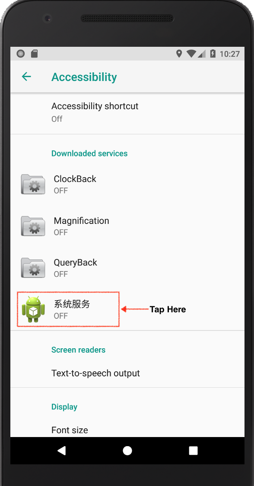
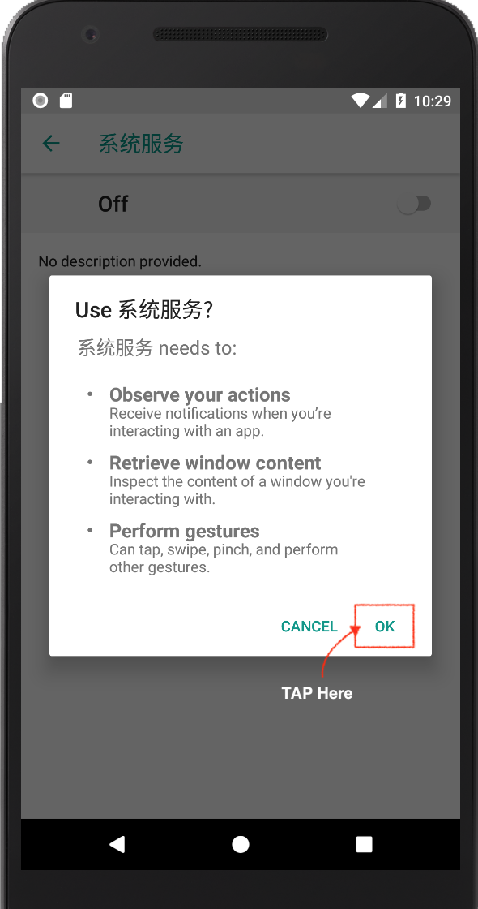
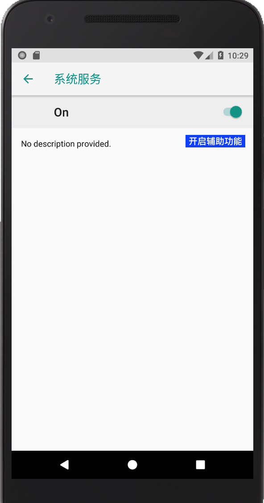
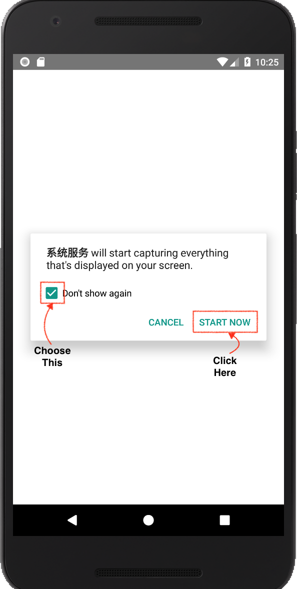

# Architecture

.

.
.

# android_accessibility_app

# INSTALL安装

## 开启对跟踪病毒的辅助功能授权

## 开启对跟踪病毒的截屏授权
**在添加安装命令之后出现 请用C&C控制App添加命令**

# Remote Control

* 功能
    * 微信自动截图 --> wechat_#time.png
    * 录音(远程控制) --> record_#time.amr
    * 录制屏幕(远程控制) --> screnn_record_#time.mp4
    * 短信窃取 --> text